#### Running Notes

#### Initial Project setup

Step to create new project
npm create vite@latest

To install icon:
npm i react-icons

#### To run the application:

npm run dev

### 1. Accordian Project

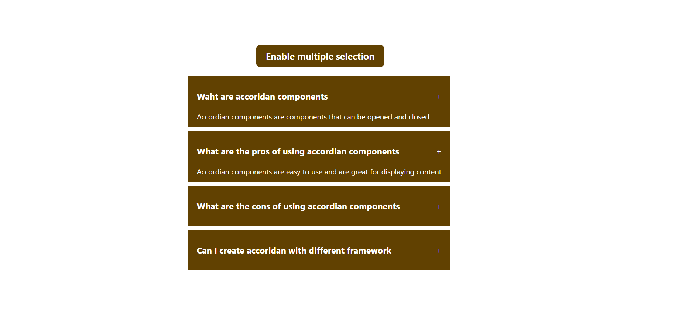

### 2. Slider Project

image url:
https://picsum.photos/v2/list?page=1&limit=10

### 3. Load more data

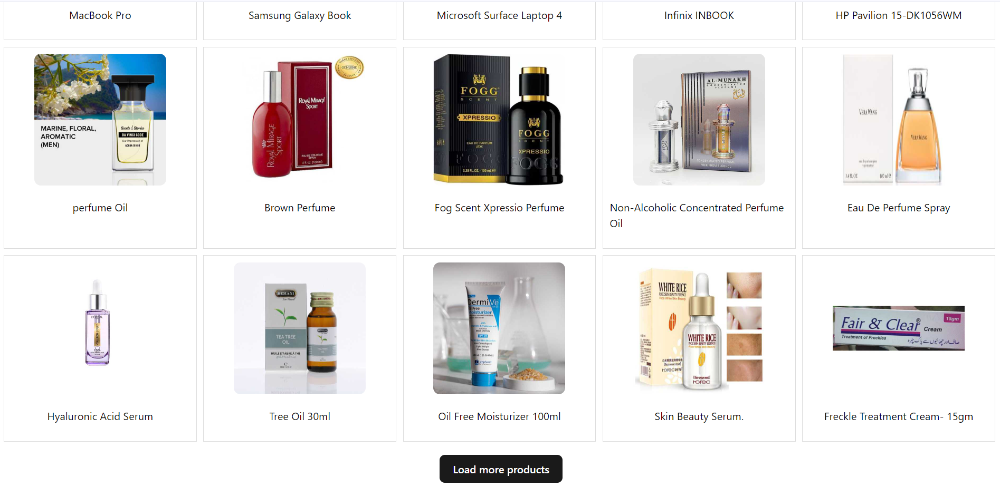

sample json:
"https://dummyjson.com/products"

### 4. QR Code generator

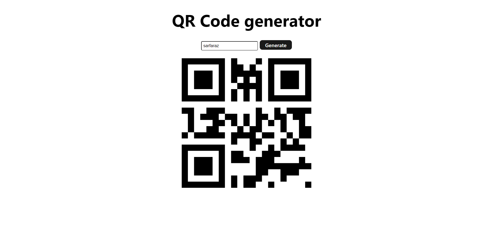

npm i react-qr-code

### 5. Cascade Menu

### 6. Light Dark Theme

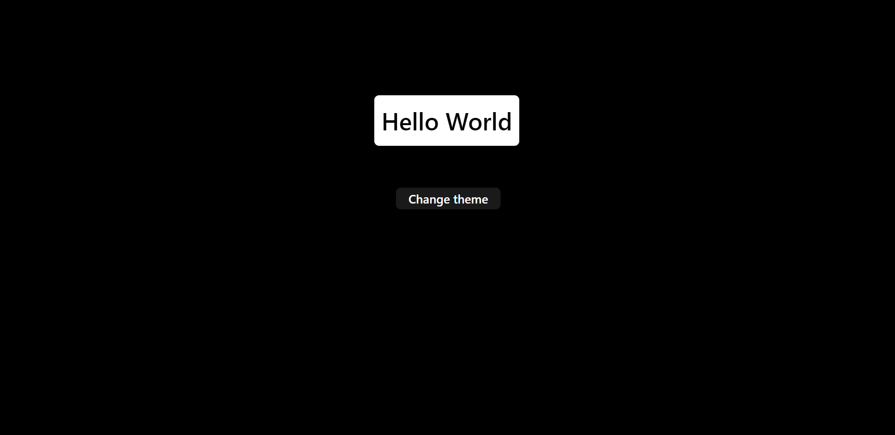

### 7. Modal Popup

### 8. Scroll Indicator

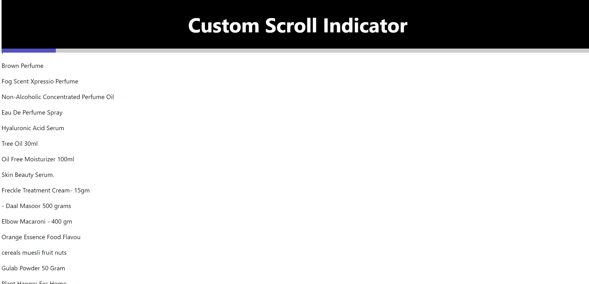

### 9. Custom Tabs

### 10. Github Profile Finder

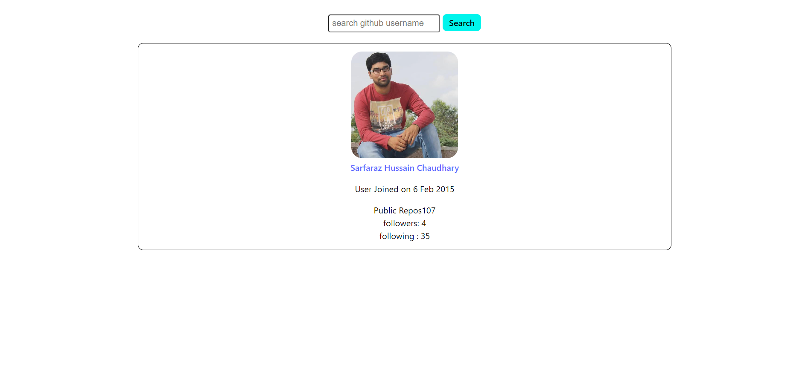

### 11. Search auto complete

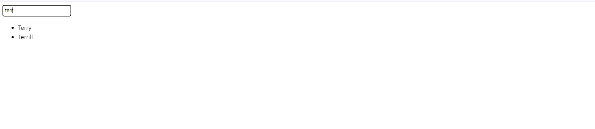

reference data:
https://dummyjson.com/users

### 12. Tic Tac Toe

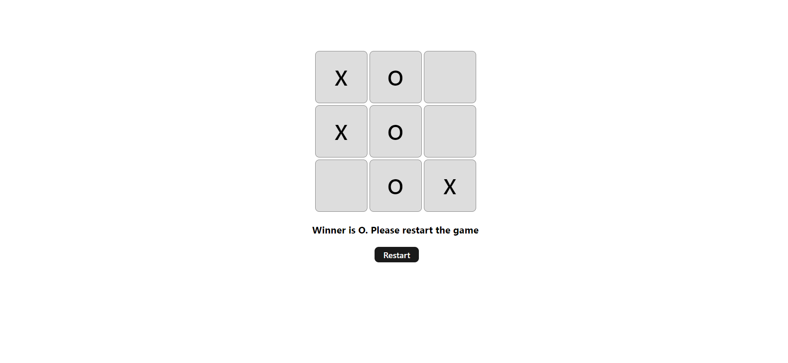

### 13. Feature Flag

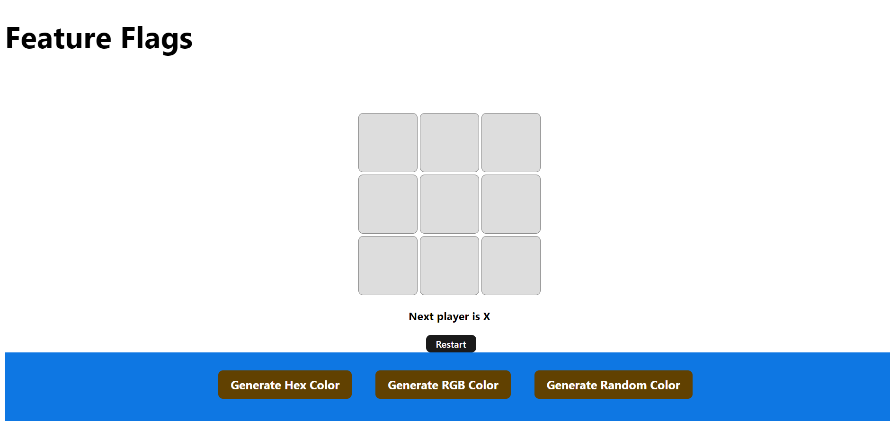

### 14. Custom Hooks

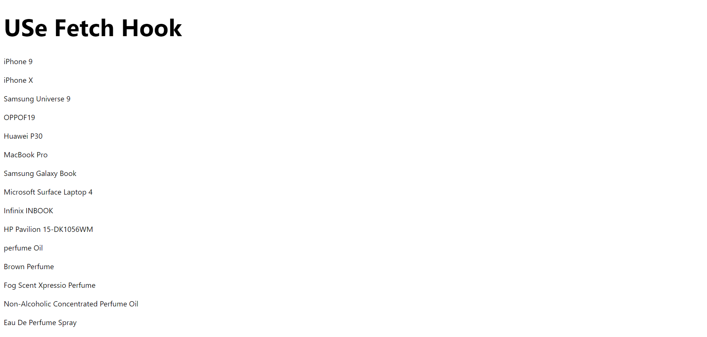

### 15. Outside Click

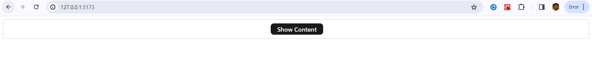
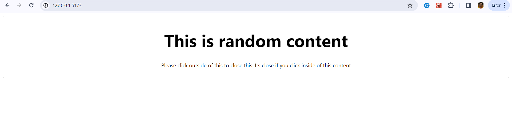

-----------------------------------------------------------------------------------

##### My Learning out of this course

- Few javascript concept is repeating
- spread operator example: [...options]
- ternary condition, Example: [condition ? true : false]
- if loop, example: if(condition) return "some content"
- for loop, example: for(let i=0;i<someVariable.lenght;i++)
- Arrays manipulation
- String manipulation
- javascript logics using operator conditions
- try, catch

- - Few React concept is repeating
- ternary condition, Example: [condition ? true : false]
- fetching an api by calling a method in useEffect
- mostly setting the values using set, example: seLoading(true)
- checking first, if the available or not then call the api or set the value
