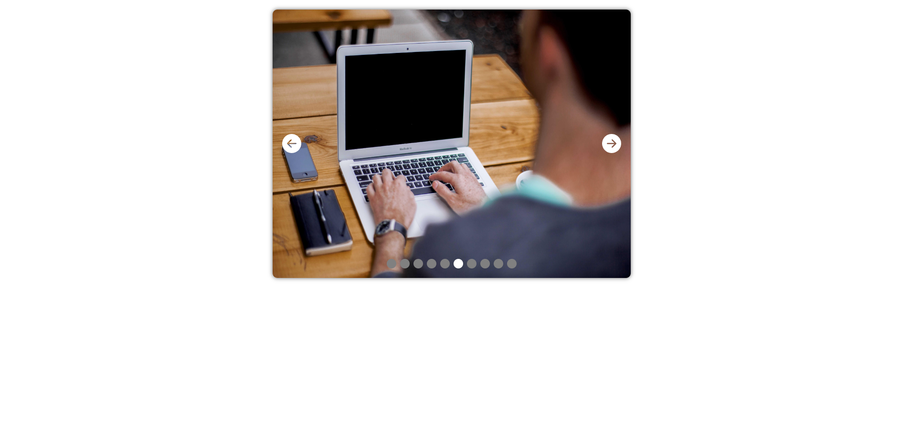

#### Running Notes

#### Initial Project setup

Step to create new project
npm create vite@latest

To install icon:
npm i react-icons

#### To run the application:

npm run dev

### Accordian Project

### Slider Project

image url:
https://picsum.photos/v2/list?page=1&limit=10

### Load more data

sample json:
dummyjson.com/docs/products

### QR Code generator

npm i react-qr-code

### Cascade Menu

### Light Dark Theme

### Modal Popup

### Scroll Indicator

### Custom Tabs

### Github Profile Finder

### Search auto complete

reference data:
https://dummyjson.com/users
